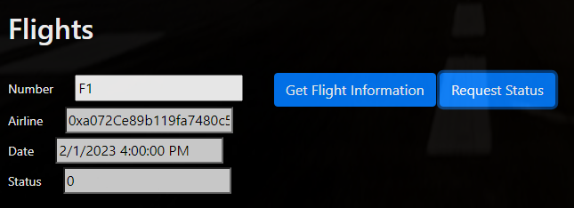

# FlightSurety

FlightSurety is a flight insurance Dapp.

FlightSurety is a sample application project for Udacity's Blockchain course.

***

## Install

`npm install`

`truffle compile`

***

## Running tests

`truffle test`

***

## Running the application

Deploy the contracts

`truffle develop`

`migrate`

Running the frontend

`npm run dapp`

Running the oracle server

`npm run server`

View the dapp:

`http://localhost:8000`

***

## Using the Application

1. Authorize the app contract

2. Fund the first airline

3. Register a new airline

4. Register a flight

5. Buy insurance for a flight

6. Request flight status

<!-- 7. The status the oracles return can be changed using the buttons

 -->

7. Withdraw credit

